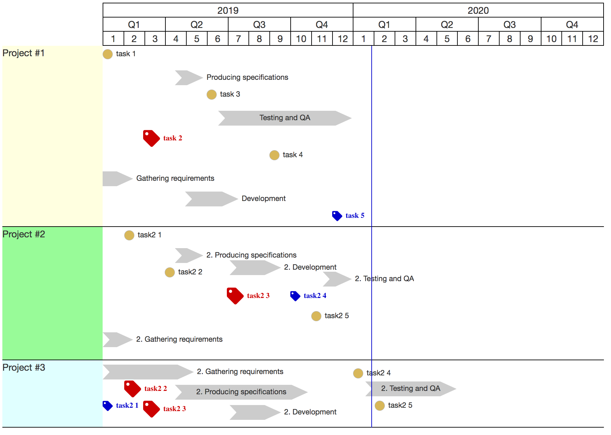

## TimelineChart
#### Description
JavaScript library for generating timeline charts. It accepts array of objects with date dimension (start, end, duration) and generates graphical representation. 

#### Usage 

	var chartData = [{
	        title: 'Project #1',
	        color: '#FFFFE0',
	        height: 150,
	        autoHeight: true,
	        single: [{
	            date: '2019-01-01',
	            title: 'task 1',
	            class: 'stagegate',
	            level: 1
	        }, {
	            date: '2019-03-01',
	            title: 'task 2',
	            class: 'milestone',
	            level: 2
	        }, {
	            date: '2019-06-01',
	            title: 'task 3',
	            class: 'stagegate',
	            level: 1
	        }, {
	            date: '2019-09-01',
	            title: 'task 4',
	            class: 'stagegate',
	            level: 2
	        }, {
	            date: '2019-12-01',
	            title: 'task 5',
	            class: 'task',
	            tooltip: 'Test tooltip',
	            level: 3
	        }],
	        range: [{
	            start: "2019-01-01",
	            end: "2019-02-14",
	            task: "Gathering requirements",
	            class: 'activity_partial',
	            level: 3
	        }, {
	            start: "2019-04-16",
	            end: "2019-05-27",
	            task: "Producing specifications",
	            class: 'activity',
	            level: 1
	        }, {
	            start: "2019-05-01",
	            end: "2019-07-18",
	            task: "Development",
	            class: 'activity',
	            level: 3
	        }, {
	            start: "2019-06-18",
	            end: "2019-12-30",
	            task: "Testing and QA",
	            class: 'activity',
	            level: 1
	        }]
	    },
	    {
	        title: 'Project #2',
	        color: '#98FB98',
	        height: 300,
	        single: [{
	            date: '2019-02-01',
	            title: 'task2 1',
	            class: 'stagegate',
	            level: 1
	        }, {
	            date: '2019-04-01',
	            title: 'task2 2',
	            class: 'stagegate',
	            level: 2
	        }, {
	            date: '2019-07-01',
	            title: 'task2 3',
	            class: 'milestone',
	            level: 3
	        }, {
	            date: '2019-10-01',
	            title: 'task2 4',
	            class: 'task',
	            level: 1
	        }, {
	            date: '2019-11-01',
	            title: 'task2 5',
	            class: 'stagegate',
	            level: 1
	        }],
	        range: [{
	            start: "2019-01-01",
	            end: "2019-02-14",
	            task: "2. Gathering requirements",
	            class: 'activity',
	            level: 2
	        }, {
	            start: "2019-04-16",
	            end: "2019-05-27",
	            task: "2. Producing specifications",
	            class: 'activity',
	            level: 2
	        }, {
	            start: "2019-07-05",
	            end: "2019-09-18",
	            task: "2. Development",
	            class: 'activity',
	            level: 1
	        }, {
	            start: "2019-11-18",
	            end: "2019-12-30",
	            task: "2. Testing and QA",
	            class: 'activity',
	            level: 1
	        }]
	    },
	    {
	        title: 'Project #3',
	        color: '#E0FFFF',
	        height: 100,
	        single: [{
	            date: '2019-01-01',
	            title: 'task2 1',
	            class: 'task'
	        }, {
	            date: '2019-02-01',
	            title: 'task2 2',
	            class: 'milestone'
	        }, {
	            date: '2019-03-01',
	            title: 'task2 3',
	            class: 'milestone'
	        }, {
	            date: '2020-01-01',
	            title: 'task2 4',
	            class: 'stagegate'
	        }, {
	            date: '2020-02-01',
	            title: 'task2 5',
	            class: 'stagegate'
	        }],
	        range: [{
	            start: "2019-01-01",
	            end: "2019-05-14",
	            task: "2. Gathering requirements",
	            class: 'activity'
	        }, {
	            start: "2019-04-16",
	            end: "2019-10-27",
	            task: "2. Producing specifications",
	            class: 'activity'
	        }, {
	            start: "2019-07-05",
	            end: "2019-09-18",
	            task: "2. Development",
	            class: 'activity'
	        }, {
	            start: "2020-01-18",
	            end: "2020-05-30",
	            task: "2. Testing and QA",
	            class: 'activity'
	        }]
	    }
	];

	var classes = {
	    milestone: {
	        title: 'Regulatory milestone',
	        class: 'fas fa-tag red',
	        width: 25,
	        height: 25
	    },
	    task: {
	        class: 'fas fa-tag blue',
	        title: 'Task',
	        width: 15,
	        height: 15
	    },
	    stagegate: {
	        image: 'images/SVG/circle_yellow.svg',
	        title: 'Stagegate',
	        width: 15,
	        height: 15
	    },
	    activity: {
	        color: '#ccc',
	        title: 'Activity',
	        height: 25
	    },
	    activity_partial: {
	        color: '#ccc',
	        title: 'Activity',
	        height: 25,
	        hideTail: true,
	        parentClass: 'activity'
	    }
	};

	var chart = TimelineChart.createChart(chartData, "#chartdiv", classes, {
	    showToday: true,
	    showTooltips: true,
	    showLabels: false,
	    legendSelector: '#legend'
	});

#### Screen Shot
